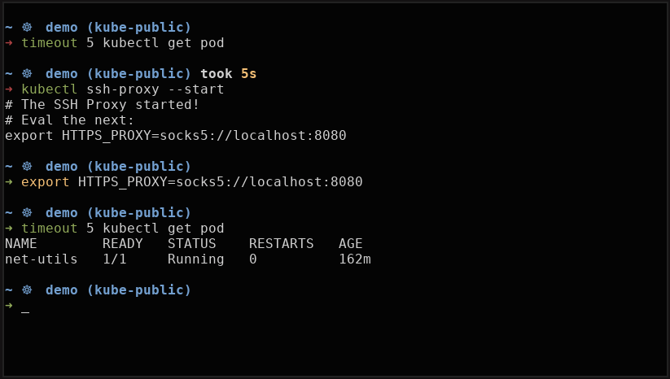

# Kubectl SSH Proxy

[](https://github.com/little-angry-clouds/kubectl-ssh-proxy/blob/master/LICENSE)
[](https://goreportcard.com/report/github.com/little-angry-clouds/kubectl-ssh-proxy)
<a href='https://github.com/jpoles1/gopherbadger' target='_blank'></a>


This plugin aims to make your life easier when using `kubectl` a cluster
that's behind a SSH bastion.

## TL;DR

`kubectl` SSH Proxy basically spans a socks proxy in the background that
`kubectl` can use. The configuration is pretty simple, edit your
`$KUBECONFIG`-ssh-proxy file and add the next section:

``` yaml
kube-ssh-proxy:
  ssh:
    host: my-bastion
    port: 22
    user: my-user
    key_path: /home/my-user/.ssh/id_rsa
  bind_port: 8080
```

It should be straightforward. The SSH connection sets the host at `my-bastion`, the
port at `22`, the user at `my-user` and the key to be used is
`/home/my-user/.ssh/id_rsa`. The `bind_port` is the port that will be set as a
proxy in your local machine.

The `key_path` is optional, if you don't set it, the plugin will try to use
an existing `ssh-agent` session.

The plugin's configuration path can also be set with the `$KUBECONFIG-SSH-PROXY`
environment variable.

## Install

Get the latest release from
[Github](https://github.com/little-angry-clouds/kubectl-ssh-proxy/releases):

``` bash
latest=$(curl --silent "https://api.github.com/repos/little-angry-clouds/kubectl-ssh-proxy/releases/latest" | grep '"tag_name":' | sed -E 's/.*"([^"]+)".*/\1/')
curl --silent https://github.com/little-angry-clouds/kubectl-ssh-proxy/releases/download/$latest/kubectl-ssh-proxy-linux-386.tar.gz -O -L
tar xf kubectl-ssh-proxy-linux*.tar.gz
sudo mv bin/kubectl-ssh_proxy* /usr/local/bin/kubectl-ssh_proxy
sudo mv bin/kube-ssh-proxy* /usr/local/bin/kube-ssh-proxy-ssh-bin
```

Disclaimer: There's binaries for windows and macOs too, but I haven't test them.
If you do and have some feedback, please share!

## Demo



## FAQ
### Why there's two binaries?

First let's explain what these binaries do. The main program, the plugin, sends the second
one, a minimalistic ssh binary, to the background.

The plugin's domain is the reading of the configuration and managing the status
of the SSH proxy. The ssh's binary domain is just span a ssh proxy.

Said that, what we're trying to do here is to have a process running a ssh proxy
and have `kubectl` to use it. To do so they have to be two different process,
because otherwise the proxy would make it impossible to use `kubectl`.

### Why make a ssh binary if there's already one?

It's a minimalistic version. Openssh it's pretty cool, but this is more simple.
You can start a ssh proxy like this:

```bash
kube-ssh-proxy-ssh-bin -H your.domain.com -p 22 -u your-user -b 8080 -k /home/your-user/.ssh/id_rsa
```

It only does this, so using openssh for this was a bit of an overkill. Also,
this way we don't have that dependency, which theoretically makes it easier to
have a multiplatform program.

### Why two different configuration files?

The development first started with the ssh's proxy configuration in the
`kubeconfig` file, but one day when changing the context, I realized that
changing the context **deletes** and rewrites all the file. So, if something is
not part of what `kubectl` expects, it's deleted.

### Why doesn't the proxy automatically set the environment variable?

Because the program is executed in a subshell, and a subshell can't never modify
variables from it's parent shell. Another example of this is aws cli's command
[ecr
get-login](https://docs.aws.amazon.com/cli/latest/reference/ecr/get-login.html).
What you can do is to just eval the output, since everything that should not be
evaluated has a comment first:

``` bash
> kubectl ssh-proxy --start
# The SSH Proxy started!
# Eval the next:
export HTTPS_PROXY=socks5://localhost:8080
```

You can do it like this:

``` bash
> eval `kubectl ssh-proxy --start`
```

### What if the cluster's domain is private?

No worries, the DNS resolution is done in the bastion machine. If the bastion
can resolve the domain, `kubectl` will.

### What OS does it support?

Since it's Go, it should work on any OS. There's binaries for windows and macOs
too, but I haven't test them. If you do and have some feedback, please share!

## License

GPL3

